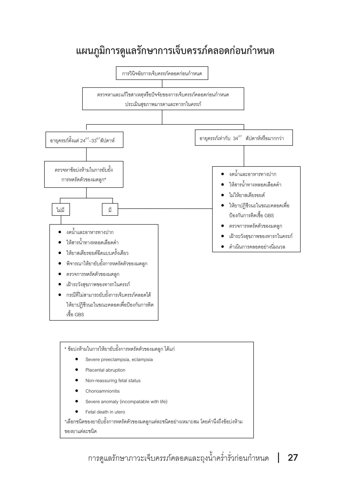
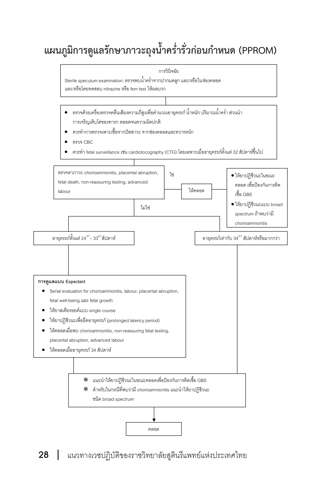

# Preterm Labor and Preterm Premature Rupture of Membranes

> [RTCOG CPG การดูแลรักษาภาวะเจ็บครรภ์คลอดและถุงน้ำคร่ำรั่วก่อนกำหนด](http://www.rtcog.or.th/home/wp-content/uploads/2017/05/OB-014-%E0%B8%81%E0%B8%B2%E0%B8%A3%E0%B8%94%E0%B8%B9%E0%B9%81%E0%B8%A5%E0%B8%A3%E0%B8%B1%E0%B8%81%E0%B8%A9%E0%B8%B2%E0%B8%A0%E0%B8%B2%E0%B8%A7%E0%B8%B0%E0%B9%80%E0%B8%88%E0%B9%87%E0%B8%9A%E0%B8%84%E0%B8%A3%E0%B8%A3%E0%B8%A0%E0%B9%8C%E0%B8%84%E0%B8%A5%E0%B8%AD%E0%B8%94%E0%B9%81%E0%B8%A5%E0%B8%B0%E0%B8%96%E0%B8%B8%E0%B8%87%E0%B8%99%E0%B9%89%E0%B8%B3%E0%B8%84%E0%B8%A3%E0%B9%88%E0%B8%B3%E0%B8%A3%E0%B8%B1%E0%B9%88%E0%B8%A7%E0%B8%81%E0%B9%88%E0%B8%AD%E0%B8%99%E0%B8%81%E0%B8%B3%E0%B8%AB%E0%B8%99%E0%B8%94.pdf)

- [Preterm Labor and Preterm Premature Rupture of Membranes](#preterm-labor-and-preterm-premature-rupture-of-membranes)
  - [Definition](#definition)
    - [Diagnosis](#diagnosis)
      - [PPROM (preterm premature rupture of membranes)](#pprom-preterm-premature-rupture-of-membranes)
      - [Threatened Preterm Labor](#threatened-preterm-labor)
    - [Causes/Mechanism](#causesmechanism)
      - [Causes](#causes)
      - [Mechanism](#mechanism)
    - [Treatment](#treatment)
      - [Threatened PTL](#threatened-ptl)
      - [PTL with intact membranes](#ptl-with-intact-membranes)
      - [PPROM Mx](#pprom-mx)

## Definition

- Preterm birth = คลอด GA 24 0/7 - 36 6/7 wk
- Preterm labor = เจ็บครรภ์คลอด + UC สม่ำเสมอ + cervical change ที่ GA 24 0/7 - 36 6/7 wk
- Late preterm labor = 34 0/7 - 36 6/7 wk
- Preterm premature rupture of membranes (PPROM) = ถุงน้ำคร่ำรั่ว ก่อนการเจ็บครรภ์ ช่วง preterm
- Low birthweight (LBW) = ทารก 1500 <= BW < 2500
- Very LBW = 1000 <= BW < 1500
- Extremely LBW = 500 <= BW < 1000

## Diagnosis of Preterm Labor

ต้องมีครบ

- GA 24 0/7 - 36 6/7
  - ถ้า GA ไม่แน่นอน -> น้ำหนัก 500+ g
- Regular UC
  - 4 in 20 min OR
  - 8 in 60 min
- Cervical change
  - dilate >= 1cm
  - effacement >= 80%

## Prevention of Preterm Labor

- Cervical cerclage
- Progesterone
- ATB for asymptomatic bacteriuria
- Avoid alcohol,substance
- Smoking cessation
- ลดอัตราการตั้งครรภ์แฝดจากเทคนิคการช่วยมีบุตรยาก
- หลีกเลี่ยงทำงานหนัก

## Management of Preterm Labor

- Check Dx
- Admit
- GA, EFW, position, presentation
- Maternal well-being: V/S, PE
- Fetal well-being: EFM, UC
- NPO
- Large bore IV (in case of blood transfuse)
- GBS prophylaxis
- หา cause
	- Ano-vaginal swab culture
	- UA, UC
	- CBC
	- U/S: AFI, anomalies, placenta, Ut, ovaries
	- Maternal
		- HT
		- Fever
		- Infection
		- U/D: Heart, immunocompromised
- แจ้งข้อมูลผู้ป่วย อาการต่างๆ + ขั้นตอนการรักษา
- แจ้งทีม: OB, Ped, Nurse(LR, NICU/PICU)
- ถ้ารพ.ดู LBW ไม่ได้ -> in-utero transfer
- ถ้าส่วนนำเป็นก้น EFW<2000g -> ควร C/S

### GA >= 34 wk

- **No** inhibit
- **No** steroid

### GA < 34 wk

- Inhibit
- ก่อน inhibit
	- Check C/I
	- บอก ADR, complications
	- Lab: Electrolyte, blood sugar, BUN, Cr, etc. ขึ้นกับยาและโรค
	- U/S: GA, number of fetus, AFI, placenta
- ขณะ inhibit
	- Observe UC -> ปรับยา
	- Monitor V/S, EFM, I/O
	- Observe ADR -> ถ้ามี -> หยุด/ลด หรือ เปลี่ยนยา
	- if non-reassuring fetal status -> หยุด/ลดยา -> IUR, notify OB, Ped
- หลัง inhibit
	- no UC 24 hr -> ลด/หยุดยา
- Single course antenatal corticosteroid

## PPROM (preterm premature rupture of membranes)

- Diagnosis
  - sterile speculum
    - posterior fornix - น้ำใส/ปน vernix
    - น้ำน้อย/ไม่พบ => ไอ
  - น้ำคร่ำ
    - pH ~ 7 (vaginal discharge pH ~ 4-4.5)
    - fern test + (ป้ายสไลด์ ทิ้งให้แห้ง ส่องเห็น fern)
- **No** digital PV
- **ไม่**สวนอุจจาระ
- Admit
- แจ้งทีม: OB, Ped, Nurse(LR, NICU/PICU)
- ถ้ารพ.ดู LBW ไม่ได้ -> in-utero transfer
- GA >= 34 wk -> induction esp. น้ำเดิน >12hr
- GA < 34 wk -> expectant
	- V/S, CBC OD
	- fetal well-being
	- U/S: AFI 2/wk
	- single course antenatal corticosteroid
	- ให้คลอดเมื่อ
		- ครบ 34 wk
		- chorioamnionitis
		- non-reassuring fetal testing
		- placental abruption
		- advanced labor
- Monitor V/S, EFM
- หา cause (เหมือน Preterm labor)
- ATB
	- ให้คลอด -> GBS prophylaxis
	- expectant -> prolonged latency period
	- chorioamnionitis -> คลอด + broad spectrum ATB
- D/C ได้ เมื่อ
	- expert opinion
	- F/U ได้ ภายใน 72hr
	- ผู้ป่วยเข้าใจอาการ,อาการแสดงของ chorioamnionitis
	- ผู้ป่วยวัด BT bid ได้
	- มา F/U ตามนัดได้

### Diagram Preterm Labor Management

### Diagram PPROM

v
v
old

#### Threatened Preterm Labor

- GA < 37 wk
- regularly UC with *no* cervical change

### Causes/Mechanism

#### Causes

- Infection
  - UTI - M/C
  - Common pathoen
    - Mycoplasma spp.
    - Ureaplasma spp.
    - Gardnerella vaginalis
    - Streptococcus spp.
  - GA น้อย สงสัย infection มากขึ้น
- Uterus
  - abnormal shape
  - tumor
  - ยืดขยายมาก เช่น
    - polyhydramnios
    - twin
- Cervix
  - previous surgery
    - LEEP/conization => short cervix
  - Congenital
    - collagen fibers ↓
- Threatened abortion
- ปัจจัยจากชีวิตประจำวัน
  - ทำงานหนัก
  - ยืนเดินนาน
  - สูบบุหรี่

#### Mechanism

- term - normal mech เจ็บครรภ์คลอด

 1. uterine contraction
 2. cervical ripening
 3. decidual/membranes activation
 4. cervical dilatation => เข้าสู่ระยะคลอด

- preterm - abnormal mech

 1. cervical ripening
 2. decidual/membranes activation
 3. increased uterine contraction
 4. cervical dilatation => เข้าสู่ระยะคลอด

- inflammation => cytokines => functional progesterone withdrawal
  - prostaglandins ↑=> decidua activation
  - uterine contraction ↑

### Treatment

#### Threatened PTL

- GA > 34 wk => expectant management
- GA 24-34 wk
  - cervical length < 30 mm => prophylactic nifedipine
  - cervical length > 30 mm => bed rest
  - progression to PTL => treat as PTL

#### PTL with intact membranes

- แก้ cause
  - GU infection
    - vaginal discharge
      - wet smear
      - culture
    - mid-stream urine culture
  - Apruptio placentae
  - Tumor
  - ประเมินการทำงานในชีวิตประจำวัน
- Inhibit uterine contraction
  - Beta agonists
  - MgSO4
  - CCB (Calcium channel blockers)
  - PGI (Prostaglandin synthase inhibitor)
- Corticosteroids for lung maturation
  - Dexamethasone 6 mg IM q 12 hr x 4 doses
  - GA 24 ~ 33+6 wk
    - ไม่เคย -> single course
    - เคย 1 course -> เกิน 7 วัน (จาก dose แรก) -> rescue course
  - GA 34 ~ 36+6 wk + risk preterm delivery within 7 days
    - ไม่เคย -> single course
- MgSO4 for neuroprotection
  - inconclusion
- ระยะคลอด
  - monitor EFM
  - active phase
    - GBS prophylaxis ควรได้อย่างน้อย 4hr ก่อนคลอด
      - Indications
        - Hx prior severe GBS ท้องก่อน
        - GBS bacteriuria
        - unknown GBS culture
        - ROM > 18 hr + fever
      - Ampicillin 2 g IV then 1 g q 4 hr
      - 2nd line
        - Vancomycin 1 g IV q 12 hr
        - Clindamycin 900 mg IV q 8 hr

#### PPROM Mx

- หา cause -> CBC
- confirm ด้วย speculum เห็นน้ำคร่ำ
- avoid digital PV (ลด risk infection)
- Expectant Mx
  - GA < 34 wk
    - Ampicillin 2 g IV + Erythromycin 250 mg q6hr x 48 hr then Amoxicillin 250 mg q8hr + Erythromycin 250 mg q6hr x 5 days
- Inhibit UC
  - พิจารณาถ้ายังไม่เข้าระยะคลอด โดยไม่ใช้ beta-agonist เนื่องจากทำให้ tachycardia masked อาการ chorioamnionitis
- Corticosteroids
  - เหมือน PTL, ไม่ต้อง rescue course
- MgSO4
  - เหมือน PTL with intact membranes
- เฝ้าระวัง Complication, การให้คลอด
  - Complication
    - Chorioamnionitis
