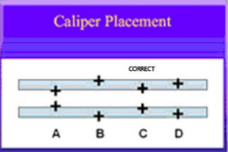

# Obstetric Ultrasound

> <https://www.aium.org/resources/guidelines/obstetric.pdf>

## Standard First-Trimester U/S

### Indications

- Confirm **intrauterine** pregnancy
- Confirm **cardiac** activity
- Estimate **GA**
- Dx/Evaluate **multiple gestation**, chorionicity
- R/O **ectopic** pregnancy
- Eval. cause of **vaginal bleeding**
- Eval. **pelvic pain**
- R/O **Gestational trophoblastic disease (GTD)**
- Fetal **anomalies**, e.g. anencephaly
- NT measurement
- adjunct to procedures
- pelvic mass, uterine abn

### Imaging parameters

transvaginal > transabdominal

- Uterus
  - Gestational sac
    - Location
    - Mean sac diameter
    - Yolk sac
    - Embryo
    - CRL
  - Dx Intrauterine pregnancy
    > Intrauterine gestational sac contain yolk sac/embryo/fetus
- Cardiac activity  
  2-D video or M-mode

  transvaginal: (usually) cardiac motion if embryo length >= 2 mm

  if cardiac motion not seen & embryo <= 7 mm; F/U 1 wk
- Fetal number
  - if multiple gestations
    - Amnionicity
    - Chorionicity
- Fetal anatomy
  - Calvarium
  - Cord insertion
  - Limbs
- Nuchal region
  
  - Guidelines for NT measurement
    1. Clear NT edge, probe perpendicular to NT line
    2. Midsagittal plane (tip of nose, palate, diencephalon)
    3. Magnified (head, neck, upper thorax)
    4. Neutral neck position, head in line with spine
    5. Amnion seen seperate from NT line
    6. Measurement at **widest** space of NT
    7. (+) calipers inner borders of nuchal line (not protrude into the space)
      
