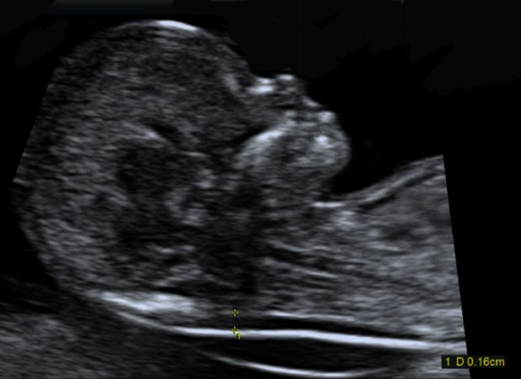

# Obstetric Ultrasound

> <https://www.aium.org/resources/guidelines/obstetric.pdf>

- [Obstetric Ultrasound](#obstetric-ultrasound)
  - [Standard First-Trimester U/S](#standard-first-trimester-us)
    - [Indications (1st-Trimester)](#indications-1st-trimester)
    - [Imaging parameters (1st-Trimester)](#imaging-parameters-1st-trimester)
  - [Standard Second- and Third-Trimester U/S](#standard-second--and-third-trimester-us)
    - [Indications (2nd-, 3rd-Trimester)](#indications-2nd--3rd-trimester)
    - [Imaging parameters (2nd-, 3rd-Trimester)](#imaging-parameters-2nd--3rd-trimester)
  - [GA assessment](#ga-assessment)
  - [Fetal weight estimation](#fetal-weight-estimation)
  - [Maternal anatomy](#maternal-anatomy)
  - [Fetal anatomic survey](#fetal-anatomic-survey)

## Standard First-Trimester U/S

### Indications (1st-Trimester)

- Confirm **intrauterine** pregnancy
- Confirm **cardiac** activity
- Estimate **GA**
- Dx/Evaluate **multiple gestation**, chorionicity
- R/O **ectopic** pregnancy
- Cause of **vaginal bleeding**
- Eval. **pelvic pain**
- R/O **Gestational trophoblastic disease (GTD)**
- Fetal **anomalies**, e.g. anencephaly
- NT measurement
- Adjunct to procedures
- Pelvic mass, Uterine abn

### Imaging parameters (1st-Trimester)

transvaginal > transabdominal

- Uterus
  - Gestational sac
    - Location
    - Mean sac diameter
    - Yolk sac
    - Embryo
    - CRL
  - Dx Intrauterine pregnancy
    > Intrauterine gestational sac contain yolk sac/embryo/fetus
- Cardiac activity  
  2-D video or M-mode

  transvaginal: (usually) cardiac motion if embryo length >= 2 mm

  if cardiac motion not seen & embryo <= 7 mm; F/U 1 wk
- Fetal number
  - if multiple gestations
    - Amnionicity
    - Chorionicity
- Fetal anatomy
  - Calvarium
  - Cord insertion
  - Limbs
- Nuchal region  
  
  
  - Guidelines for NT measurement
    1. Clear NT edge, probe perpendicular to NT line
    2. Midsagittal plane (tip of nose, palate, diencephalon)
    3. Magnified (head, neck, upper thorax)
    4. Neutral neck position, head in line with spine
    5. Amnion seen seperate from NT line
    6. Measurement at **widest** space of NT
    7. (+) calipers inner borders of nuchal line (not protrude into the space)  
      
- Other abnormal structures
  - Adnexal mass
  - Leiomyomata
  - Cul-de-sac
  - Uterine anomalies

## Standard Second- and Third-Trimester U/S

### Indications (2nd-, 3rd-Trimester)

- Screening anomalies
- Anatomy
- Estimate GA
- R/O Multiple gestation
- Cervical length
- Fetal growth
- Discrepancy of Ut size and dates
- Fetal presentation
- Fetal well-being
- Amniotic fluid abnormalities
- PROM, premature labor
- Vaginal bleeding
- Abd, pelvic pain
- R/O placental abruption
- R/O fetal death
- F/U fetal anomaly
- Placental
  - Appearance
  - Location
  - Abn (previa, vasa previa)
- Adjunct to procedure
- Adjunct to external cephalic version
- R/O GTD
- Pelvic mass, Ut anomalies

### Imaging parameters (2nd-, 3rd-Trimester)

[underconstruction]

- Fetal cardiac activity (by video, M-mode)
- Fetal number
- Presenttion
- Abnormal HR, rhythm
- Amniotic fluid volume
  - AFI
  - Oligohydramnios single deepest pocket <2 cm (AFI<=5 cm)
  - Polyhydramnios deepest vertical pocket >=8 cm, (AFI>=24 cm)
- Placenta
  - Location
  - Appearance
  - Relationship with internal cervical os
    - umbilical cord
    - number of vessels in cord

## GA assessment

- 1st-trimester => CRL (**C**rown-**R**ump **L**ength) most accurate
- 2nd,3rd-trimester
  - BPD (**B**i**P**arietal **D**iameter)
    - level of thalami, cavum septi pellucidi
    - should not seen cerebellar
    - outer proximal to inner distal skull
  - HC (**H**ead **C**ircumference)
    - same level as BPD
    - outer bony calvarium
    - not included SC tissue
  - FL (**F**emoral diaphysis **L**ength)
    - GA > 14 wk
    - long axis of femoral shaft
    - US perpendicular to shaft
    - exclude distal femoral epiphysis
  - AC (**A**bdominal **C**ircumference)
    - skin line
    - true transverse view
      - junction of umbilical vein
      - portal sinus
      - fetal stomach

## Fetal weight estimation

- Parameters used
  - BPD
  - HC
  - AC
  - FL
- Growth evaluation q3+wk
- Error +-15%

## Maternal anatomy

- Adnexal mass
  - esp. largest+potentially clinically significant leiomyomata
  - 2nd-,3rd-trimester -> difficult to image ovaries
- Cervix
  - TAS: if abnormal or precise cervical length -> TVS
- Midline lower Ut segment contraction may obscure internal os -> false longer endocervical canal
- Excessive pressure with U/S may -> false longer cervix

## Fetal anatomic survey

following content for GA 18+ wk

Difficult to visualize factors

- fetal size
- position
- movement
- abd scars
- increased maternal abd wall thickness
- 2nd-,3rd-trimester -> artifact from acoustic shadowing

Standard examination areas

1. Head, face, neck
    - Lateral cerebral ventricles
    - Choroid plexus
    - Midline falx
    - Cavum septi pelluci
    - Cerebellum
    - Cisternal magna
    - Upper lip
    - Nuchal fold (GA 16-20 -> assess risk of aneuploidy)
2. Chest
    - Heart
    - Four-chamber view, heart size, position
    - Left ventricular outflow tract (LVOT)
    - RVOT
    - Three-vessel view, 3-vessel trachea view
3. Abdomen
    - Stomach (presence, size, situs)
    - Kidneys
    - Urinary bladder
    - Umbilical cord insertion site to fetal abd.
    - Umbilical cord vessel number
4. Spine
5. Extremities
6. External genitalia
    - esp. in multiple gestations
